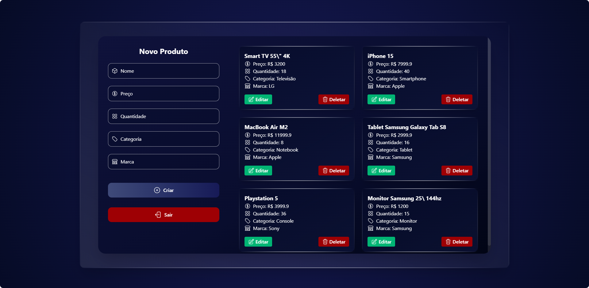
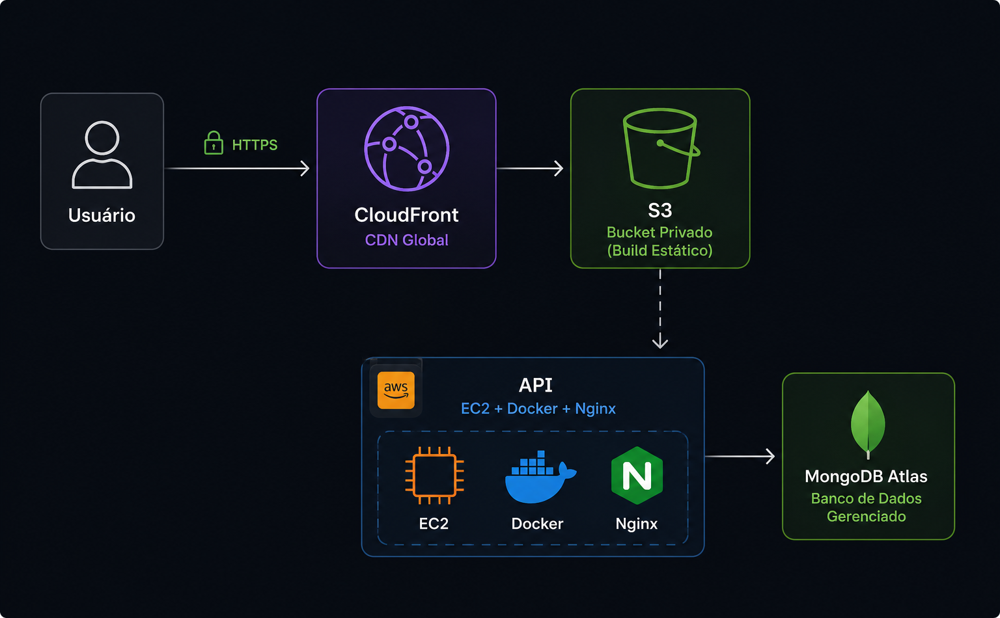

# 📦 Inventory Dashboard — Frontend

Aplicação web desenvolvida em React + Vite, estilizada com TailwindCSS, responsável por consumir a API de inventário e exibir o painel interativo com login, listagem e controle de produtos.

---

---

## 🚀 Tecnologias Utilizadas

- React
- Vite
- TailwindCSS
- Axios (requisições HTTP)
- React Router DOM
- Zod (validação)
- JWT no localStorage
- Context API para autenticação

## ☁️ Infraestrutura e Deploy (AWS)

O frontend é hospedado como um site estático em infraestrutura AWS, servido globalmente via CDN:
 
| Componente | Tecnologia |
|---|---|
| Armazenamento estático | AWS S3 (bucket privado) |
| CDN / HTTPS | AWS CloudFront (Origin Access Control) |
| Backend consumido | API própria em AWS EC2 (ver repositório do backend) |
 
**Frontend em produção:** `https://d1pvxrw67lwcz1.cloudfront.net`

### Arquitetura

---

---

O bucket S3 é **privado** — todo o acesso é intermediado pelo CloudFront via Origin Access Control (OAC), sem exposição pública direta do armazenamento.

## ⚙️ Funcionalidades
 
- 🔐 Login com JWT
- 👤 Acesso como convidado
- 📦 Listagem de produtos
- ➕ Cadastro de produto
- ✏️ Atualização de produto
- 🗑️ Exclusão de produto
- 📊 Dashboard interativo
- 🚫 Redirecionamento automático ao deslogar/token inválido

## 🔗 Projeto relacionado
 
Backend: *([ Link do repositório do backend ](https://github.com/v1nicius28/api-inventory-dashboard))*
